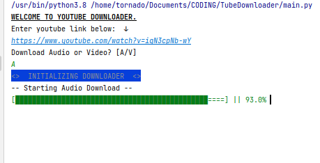
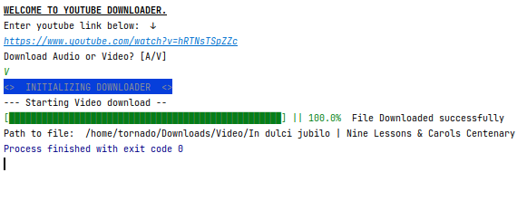

<h1>YVDownloader</h1>

## About
A python script for downloading video and/or audio files from youtube.
This script takes a youtube url and returns video and/or audio stream objects to be download. 
This script access the current user to set the download paths.

<h3>Features</h3>
Users can: 
<ul>
<li>input video url</li>
<li>specify the file type to download; ie video or audio</li>
</ul>

<h3> Preview </h3>

## Core Stack
<ul>
<li>
<a href='https://www.python.org/' >python</a>
</li>
<li>
<a href='https://pytube.io/en/latest/user/quickstart.html' >pytube</a>
</li>
</ul>

## Next
<ul>
<li> Download all files ina playlist</li>
<li> Migrate interface from terminal to GUI </li>
</ul>

